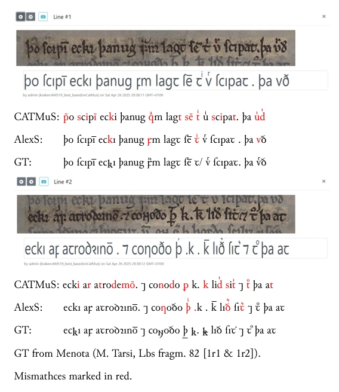

<h1>OICEN-HTR</h1>
<h2>Old Icelandic / Norse Handwritten Text Recognition</h2>

[](https://doi.org/10.5281/zenodo.15315438)

This repository contains HTR models fine-tuned on Old Icelandic manuscripts. It also contains the ground truth data, but not the images, as they are usually available on <a href = "https://handrit.is/">Handrit.is</a>.

Current models are better suited for Old Icelandic manuscripts than CATMuS. They produce good results, but the recognition of diacritica is imperfect. 

<hr/>



<hr/>

- Annotation from <a href="https://www.menota.org/forside.xhtml">Menota</a>. 

- Fine-tuned on <a href = "https://zenodo.org/records/15030337">CATMuS Medieval 1.6.0</a>.

- Training, validation, test set (unless  otherwise specified): 0.8, 0.1, 0.1 .

- Initials excluded...

- Use it either with <a href = "https://github.com/mittagessen/kraken">Kraken</a> or <a href="https://gitlab.com/scripta/escriptorium">eScriptorum</a> (recommended). 

- Ground truth data available for re-usability. They can be easily uploaded to an eScriptorum instance and edited there. NB: the image names should match those in the ground truth xml files.

- Plan: 

    - Ultimately, to train one model on various manuscripts.

    - Finish AM 132 fol. (MB). Currently 1/3 of the manuscript is annotated.

    - Finish Codex Wormianus based on <a href = "https://clarino.uib.no/menota/text/menota/AM-242-fol">Menota AM 242 fol</a> by Karl Gunnar Johansson and Codex Regius based on <a href = "https://eae.ku.dk/q?p=eae/vols/xml/1">EAE GKS 2365 4to</a> by Guðvarður Már Gunnlaugsson, Haraldur Bernharðsson, Vésteinn Ólason, et al.

<hr/>

<table>

<th>Model</th>
<th> Accuracy (char, word)</th>
<th>Val. Accuracy</th>
<th>Annotation based on</th>
<th>Images</th>
<th>Fine-Tuned on</th>
<th>Status</th>
<th>Version</th>
<th>Notes</th>

<tr>
<td><a href = "./models/AlexS">AlexS</a></td>
<td>
    <ul>
        <li><strong>Characters</strong>: 239194</li>
        <li><strong>Errors</strong>: 2858</li>
        <li><strong>Character Accuracy</strong>: 98.81%</li>
        <li><strong>Word Accuracy</strong>: 96.70%</li>
        <li><a href = "./models/AlexS/AM519_best_report.txt"><strong>Report</strong></a></li>
    </ul>
</td>
<td>0.963 (word 0.908)</td>
<td><a href = "https://clarino.uib.no/menota/text/menota/AM-519a-4to">Menota AM 519 a 4to </a> by de Leeuw van Weene</td>
<td><a href = "AM 519 a 4to">Handrit</a></td>
<td>=</td>
<td>✔️</td>
<td>1.0</td>
<td>...</td>
</tr>

<tr>
<td><a href = "./models/MB/">MB</td>
<td>
    <ul>
        <li><strong>Characters</strong>: 1024302</li>
        <li><strong>Errors</strong>: 10128</li>
        <li><strong>Character Accuracy</strong>: 99.01%</li>
        <li><strong>Word Accuracy</strong>: 96.67%</li>
        <li><a href = "./models/MB/AM132_33_report.txt"><strong>Report</strong></a></li>
    </ul>
</td>
<td>0.99 (word 0.972)</td>
<td><a href = "https://clarino.uib.no/menota/text/menota/AM-132-fol-Njals-saga">Menota AM 132 fol</a> by de Leeuw van Weene </td>
<td><a href = "https://handrit.is/manuscript/view/is/AM02-0132/0#mode/2up">Handrit</a> (but cropped for columns!)</td>
<td>=</td>
<td>255/750 columns = 1/3, from the first half of the manuscript (with exceptions; cf. GT).</td>
<td>0.3</td>
<td> Trained on manually cropped columns (share per request). This model is likely overfitted.
</td>
</tr>

<tr>
<td>Combined</td>
<td></td>
<td></td>
<td></td>
<td></td>
<td></td>
<td></td>
<td>WIP (maybe late 2025)</td>
<td>Plan to train a model on various manuscripts (above).</td>
</tr>

</table>

<h2>Details</h2>

- Annotation based on the facsimile level of the manuscripts (see Menota's approach to encoding manuscripts)

- Compiled into binary with the following command:

```bash
ketos compile -F manifest.txt --random-split 0.8 0.1 0.1 -f page --workers 4
```
(where manifest.txt is the file containing the path of xml files)

- The models are fine-tuned with the following command:

```bash
ketos train -f binary dataset.arrow -i catmus-medieval-1.6.0.mlmodel --resize new -d cuda:0 -o ./AM519 -B 64 -r 0.001 -u NFD
```
(dataset.arrow is the binary file created with the compile command above)

- The models are evaluated with the following command:

```bash
ketos test -m AM519_best.mlmodel -f binary dataset.arrow -u NFD -d cuda:0 -B 32 --threads 4 --workers 4
```

- I tried training without fine-tuning, but the results were not good at all (I did try different learning rates, but the maximal accuracy I managed to get was 5%). I used the following command:

```bash
ketos train -f binary dataset.arrow -d cuda:0 -o ./AM519 -B 64 -r 0.001
```

<h2>Contact</h2>
<p>For inquiries of any kind, find my contact information on my <a href="https://nkcz.github.io/">website</a>.</p>
<p>Created on 28.04.2025</p>
