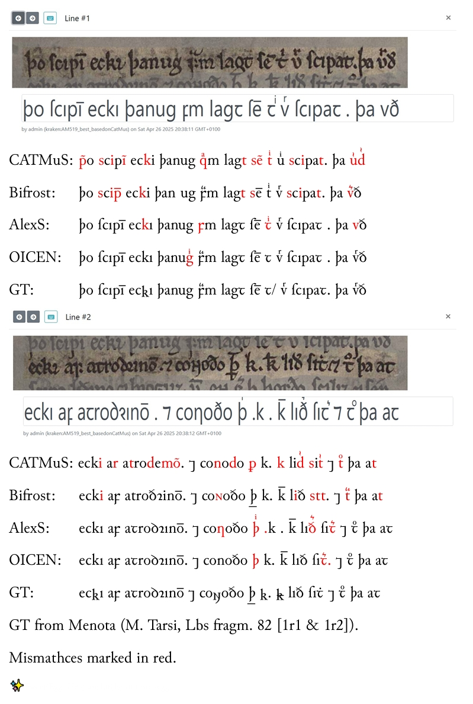

<h1>OICEN-HTR</h1>
<h2>Old Icelandic / Norse Handwritten Text Recognition</h2>
<h3>Nikola Krisztian Czindrity</h3>

[](https://doi.org/10.5281/zenodo.15315438)

This repository contains HTR models fine-tuned on Old Icelandic manuscripts. The ground truth data is contained in the repository <a href = "https://github.com/NKCZ/oicen-htr-data">OICEN-HTR/ground_truth</a> (WIP). Unless otherwise specified, the images stem from <a href = "https://handrit.is/">Handrit.is</a>.

Link to <a href = "https://doi.org/10.5281/zenodo.15315438">Zenodo</a> (v2; it is currently outdated by v3, see below). 

The current best performing model is OICEN Core Model (v3).

<h2> Models and Comparison in Charactar and Word Accuracy</h2>

<table>
  <thead>
    <tr>
      <th>Tests<br>(Character / Word Accuracy)</th>
      <th>Estimated Difficulty <br> "Readibility"</th>
      <th><a href="#catmus">CATMuS</a></th>
      <th><a href="#bifrost">Bifrost</a></th>
      <th><a href="#oicen-core-v2">Previous Core OICEN model (v2)</a></th>
      <th><a href="#oicen-core-v3">Core OICEN Model</a> (WIP v3)</th>
      <th><a href="#fragments">Fragments Model</a> (WIP)</th>
    </tr>
  </thead>
  <tbody>
    <tr>
      <td>In-Domain Test (resp.)</td>
      <td>Easy</td>
      <td>(see their paper)</td>
      <td>(see their paper)</td>
      <td>0.97 / 0.91</td>
      <td>0.94 / 0.82</td>
      <td>0.90 / 0.72</td>
    </tr>
    <tr>
      <td>OICEN Core v.0.3 In-Domain Test</td>
      <td>Medium</td>
      <td>0.52 / 0.08</td>
      <td>0.53 / 0.1</td>
      <td>0.93 / 0.82</td>
      <td><strong>0.94 / 0.82</strong></td>
      <td>0.72 / 0.34</td>
    </tr>
    <tr>
      <td>Proper Out-of-Domain Tests</td>
      <td></td>
      <td></td>
      <td></td>
      <td></td>
      <td></td>
      <td></td>
    <tr>
      <td>Kringla-Fragment</td>
      <td>Easy</td>
      <td>0.51 / 0.07</td>
      <td>0.66 / 0.23</td>
      <td>0.81 / 0.48</td>
      <td><strong>0.86 / 0.59</strong></td>
      <td>0.86 / 0.58</td>
    </tr>
    <tr>
      <td>Codex Frisianus</td>
      <td>Easy</td>
      <td>0.49 / 0.07</td>
      <td>0.64 / 0.22</td>
      <td>0.80 / 0.43</td>
      <td>0.81 / 0.46</td>
      <td><strong>0.83 / 0.48</strong></td>
    </tr>
    <tr>
      <td>DG 4-7<br>(Pamphilus saga)</td>
      <td>Easy</td>
      <td>0.58 / 0.10</td>
      <td>0.60 / 0.14</td>
      <td>0.87 / 0.64</td>
      <td><strong>0.88 / 0.66</strong></td>
      <td>0.85 / 0.61</td>
    </tr>
    <tr>
      <td>NRA Fragm 7</td>
      <td>Medium</td>
      <td>0.58 / 0.12</td>
      <td>0.56 / 0.11</td>
      <td>0.77 / 0.43</td>
      <td><strong>0.79 / 0.47</strong></td>
      <td>0.75 / 0.39</td>
    </tr>
    <tr>
      <td>AM 279 A 4to</td>
      <td>Difficult</td>
      <td>0.46 / 0.04</td>
      <td>0.57 / 0.15</td>
      <td>0.72 / 0.34</td>
      <td>0.76 / 0.39</td>
      <td><strong>0.76 / 0.51</strong></td>
    </tr>
    <tr>
      <td><strong>Average Accuracy</strong></td>
      <td>-</td>
      <td>0.52 / 0.08</td>
      <td>0.59 / 0.18</td>
      <td>0.81 / 0.52</td>
      <td><strong>0.84 / 0.56</strong></td>
      <td>0.79 / 0.48</td>
    </tr>
  </tbody>
</table>

<h3 id="catmus">CATMuS Medieval 1.6.0</h3>

Available at <a href = "https://zenodo.org/records/15030337">Zenodo</a>.

<h3 id="alexs">AlexS</h3>

The first model from this repository, released on 28.04.2025, and one of the first openly available models for Old Icelandic HTR. It was trained on 73 pages from <i>Alexanders saga</i> (MENOTA <a href="https://clarino.uib.no/menota/text/menota/AM-519a-4to" target="_blank">AM 519 a 4to</a>). It was fine-tuned on the CATMuS Medieval 1.6.0 model. It achieved a character accuracy of 98.81% and a word accuracy of 96.70% for its in-domain test. Available as legacy model at <a href = "./models/legacy/AlexS">AlexS</a>.

<h3 id="bifrost">Bifrost</h3>

Bifrost is one of the first openly available HTR models for Old Icelandic manuscripts. It was released in May 2025 by Kapitan and Vidal-Gorène. It was trained on 8 pages from two manuscripts (AM 242 fol and AM 334 fol). It achieved remarkably good results, despite a significantly smaller training set than the one used on my models.
Available at <a href = "https://zenodo.org/records/15366732">Zenodo</a> and see their paper for DH 2025 Lisbon.


<h3 id="oicen-core-v2">OICEN Core Model (v2)</h3>

Legacy model. It was released on xx.05.2025. It was trained on 73 pages from <i>Alexanders saga</i> (AM 519 a 4to), 126 pages from <i>Codex Wormianus</i> (AM 242 fol), and 255 columns from <i>Möðruvallabók</i> (AM 132 fol) (see oicen-core-v3 for attributions) It achieved a character accuracy of 0.97 and a word accuracy of 0.91 for its in-domain test. Available under its former name at <a href = "./models/corev2/Combined_26.mlmodel">Combined</a>.

<h3 id="oicen-core-v3">OICEN Core Model (WIP v3)</h3>

The current best performing model (see eval results in the table above). It is available at <a href = "./models/corev3/core_oicenv3_best.mlmodel">OICEN Core Model (v3)</a>. It was trained on on facsimile level transcription from MENOTA and EAE editions of the following manuscripts:

* 720 columns across 200 pages (i.e., almost complete) from AM 132 fol (<i>Möðruvallabók</i> transcribed and edited by Andrea de Leeuw van Weenen, available at <a href = "https://clarino.uib.no/menota/text/menota/AM-132-fol-Njals-saga">MENOTA</a>)

* 126 pages from AM 242 fol (<i>Codex Wormianus</i> transcribed and edited by Karl Gunnar Johannson, available at <a href = "https://clarino.uib.no/menota/text/menota/AM-242-fol">MENOTA</a>)

* 73 pages fromAM 519 a 4to (<i>Alexanders saga</i> transcribed and edited by Andrea de Leeuw van Weenen, available at <a href = "https://clarino.uib.no/menota/text/menota/AM-519a-4to">MENOTA</a>) 

* 82 pages from AM 677 4to (transcribed and edited by Andrea de Leeuw van Weenen, available at <a href = "https://clarino.uib.no/menota/text/menota/AM-677-4to">MENOTA</a>)

* 4 pages from AM 162 B Theta fol (two fragments of Njáls saga transcribed and edited by Beeke Stegmann, available at <a href = "https://clarino.uib.no/menota/text/menota/AM-162-B-fol-theta">MENOTA</a>)

* 4 pages from AM 162 B Kappa fol (fragment of Njáls saga transcribed and edited by Beeke Stegmann, available at <a href = "https://clarino.uib.no/menota/text/menota/AM-162-B-fol-kappa">MENOTA</a>)

* 90 pages from GKS 2365 4to (Codex Regius of the Poetic Edda transcribed and edited by Guðvarður Már Gunnlaugsson, Haraldur Bernharðsson, and Vésteinn Ólason, available at <a href = "https://eae.ku.dk/q?p=eae/vols/xml/1">EAE</a>)

According to the report from eScriptorium, the model contains 1110 image files, 42853 lines, 556793 words, and 2365325 characters. Just as the previous model, it was fine-tuned on the CATMuS Medieval 1.6.0 model. It achieved a character accuracy of 0.94 and a word accuracy of 0.82 for its in-domain test. 

The first WIP version was released on 25.08.2026 (current).

! It might not be the final version of this model, I am still working towards improving the results !

<h3 id="fragments">Fragments Model (WIP)</h3>

This model is based on fragments listed in MENOTA as transcribed and edited by Nina Stensaker and has been fine-tuned on the WIP version of OICEN Core Model (v3). The model is available at <a href = "./models/fragments/Fragments_best_resize_new.mlmodel">Fragments Model (WIP)</a>. One great advantage of this model should be the diversity of hands and homogenous editorial practices by Nina Stensaker. It achieved a character accuracy of 0.90 and a word accuracy of 0.72 for its in-domain test.

It includes around 30 group of fragments from NRA, namely NRA norrfragm 51-80 (excl. 60 A, 74, 75, 81 A & B, and some difficult lines and pages), AM 1056 IX 4to (excl. 2v), and AM 383 I 4to.

The first WIP version was released on 25.08.2026 (current).

! WIP, as I still have hope to improve the results for this model !

Few observations include: 1) --resize union yield worse results than --resize new. 2) I trained on --augment. 3) TODO

<h2> Out-of-Domain Tests</h2>

* Kringla-Fragment (Lbs fragm. 82) transcribed and edited by Matteo Tarsi, available at <a href = "https://clarino.uib.no/menota/text/menota/Lbs-fragm-82">MENOTA</a>.

* Codex Frisianus (AM 45 fol) 1r-6r and 46v-46r transcribed and edited by Robert Kristof Paulsen, available at <a href="https://emroon.no/manuscripts/AM-45-fol/meta">EMROON</a>.

* DG 4-7 (Pamphilus saga) 3-5v  transcribed and edited by Haugen, Paulsen, Stensaker, Leslie-Jacobsen, Kvakland, Koesling, Zeit-Altpeter, Sulollari, Tveit, Kraus, Rocca, and Steintún, available at <a href="https://emroon.no/manuscripts/DG-4-7/meta">EMROON</a>.

* NRA norrfragm 7 transcribed and edited by <i>The Bergen Group</i>, available at <a href="https://clarino.uib.no/menota/text/menota/NRA-norrfragm-7">MENOTA</a>.

* AM 279 a 4to transcribed and edited by Nina Stensaker, available at <a href="https://clarino.uib.no/menota/text/menota/AM-279-a-4to">MENOTA</a>.

<h2> (Old v2) Comparison of the first and second line of Kringla</h2>



<i>Some diacritic marks are not rendered correctly neither in the image above nor in the accompanying PDF (?), see the Word document with Junicode.</i>

<hr/>

<h2>Details</h2>

- Annotation from <a href="https://www.menota.org/forside.xhtml">Menota</a>. 

- Fine-tuned on <a href = "https://zenodo.org/records/15030337">CATMuS Medieval 1.6.0</a>.

- Training, validation, test set (unless  otherwise specified): 0.8, 0.1, 0.1 .

- Initials excluded...

- Use it either with <a href = "https://github.com/mittagessen/kraken">Kraken</a> or <a href="https://gitlab.com/scripta/escriptorium">eScriptorum</a> (recommended). 

- Ground truth data available for re-usability. They can be easily uploaded to an eScriptorum instance and edited there. NB: the image names should match those in the ground truth xml files.

- Why train separate models for each manuscript? Diverging scribal styles, re-usability on manuscripts with same hands (e.g., AM 242 fol and AM 227 fol), different annotators, initial tests to figure out what works and not, and similar. This will not be done for all manuscripts, but only for those that are of interest.

- Plan: 

    - <del>Finish AM 132 fol. (MB). Currently 1/3 of the manuscript is annotated.</del> I consider it finished!

    - <del>Finish Codex Regius based on <a href = "https://eae.ku.dk/q?p=eae/vols/xml/1">EAE GKS 2365 4to</a> by Guðvarður Már Gunnlaugsson, Haraldur Bernharðsson, Vésteinn Ólason, et al.</del> Finished!

<hr/>

<h2>Legacy Models</h2>
<table>

<th>Model</th>
<th>Accuracy (char, word)</th>
<th>Val. Accuracy</th>
<th>Annotation based on</th>
<th>Images</th>
<th>Fine-Tuned on</th>
<th>Status</th>
<th>Version</th>
<th>Notes</th>

<tr>
<td><a href = "./models/AlexS">AlexS</a></td>
<td>
    <ul>
        <li><strong>Characters</strong>: 239194</li>
        <li><strong>Errors</strong>: 2858</li>
        <li><strong>Character Accuracy</strong>: 98.81%</li>
        <li><strong>Word Accuracy</strong>: 96.70%</li>
        <li><a href = "./models/AlexS/AM519_best_report.txt"><strong>Report</strong></a></li>
    </ul>
</td>
<td>0.963 (word 0.908)</td>
<td><a href = "https://clarino.uib.no/menota/text/menota/AM-519a-4to">Menota AM 519 a 4to (v. 1.0.5)</a> by de Leeuw van Weene</td>
<td><a href = "AM 519 a 4to">Handrit</a></td>
<td>=</td>
<td>✔️</td>
<td>1.0</td>
<td>...</td>
</tr>

<tr>
<td><a href = "./models/CodWorm/">CodWorm</td>
<td>
    <ul>
        <li><strong>Characters</strong>: 330105</li>
        <li><strong>Errors</strong>: 2979</li>
        <li><strong>Character Accuracy</strong>: 99.10%</li>
        <li><strong>Word Accuracy</strong>: 96.21%</li>
        <li><a href = "./models/CodWorm/CodWorm_best_report.txt"><strong>Report</strong></a></li>
    </ul>
</td>
<td>0.965 (word 0.862)</td>
<td><a href = "https://clarino.uib.no/menota/text/menota/AM-242-fol">Menota AM 242 fol (v. 0.9.9)</a> by Karl Gunnar Johansson </td>
<td><a href = "https://handrit.is/manuscript/view/da/AM02-0242/0#mode/2up">Handrit</a></td>
<td>=</td>
<td>✔️</td>
<td>1.0</td>
<td> Almost all lines. Images resized and cropped (see <a href="">info</a>).</td>
</tr>

<tr>
<td><a href = "./models/MB/">MB</td>
<td>
    <ul>
        <li><strong>Characters</strong>: 1024302</li>
        <li><strong>Errors</strong>: 10128</li>
        <li><strong>Character Accuracy</strong>: 99.01%</li>
        <li><strong>Word Accuracy</strong>: 96.67%</li>
        <li><a href = "./models/MB/AM132_33_report.txt"><strong>Report</strong></a></li>
    </ul>
</td>
<td>0.99 (word 0.972)</td>
<td><a href = "https://clarino.uib.no/menota/text/menota/AM-132-fol-Njals-saga">Menota AM 132 fol (v. 1.0)</a> by de Leeuw van Weene </td>
<td><a href = "https://handrit.is/manuscript/view/is/AM02-0132/0#mode/2up">Handrit</a> (but cropped for columns!)</td>
<td>=</td>
<td>255/750 columns = 1/3, from the first half of the manuscript (with exceptions; cf. GT).</td>
<td>0.3</td>
<td> Trained on manually cropped columns (share per request). This model is likely overfitted.
</td>
</tr>

<tr>
<td><a href="./models/Combined/">Combined</a></td>
<td>
    <ul>
        <li><strong>Characters</strong>: 1081450</li>
        <li><strong>Errors</strong>: 27999</li>
        <li><strong>Character Accuracy</strong>: 97.41%</li>
        <li><strong>Word Accuracy</strong>: 91.42%</li>
        <li><a href = "./models/Combined/Combined_26_report.txt"><strong>Report</strong></a></li>
    </ul>
</td>
<td>0.958 (word 0.864)</td>
<td>All of the above</td>
<td>All of the above</td>
<td>=</td>
<td>WIP</td>
<td>0.1</td>
<td>A model fine-tuned on all of the manuscripts from above.</td>
</tr>

</table>

<h2>Training Details</h2>

- Annotation based on the facsimile level encoding of the manuscripts (see Menota's approach to encoding manuscripts)

- eScriptorium was utilised to align text to lines.

- Compiled into binary with the following command:

```bash
ketos compile -F manifest.txt --random-split 0.8 0.1 0.1 -f page --workers 4
```
(where manifest.txt is the file containing the path of xml files)

- The models are fine-tuned with the following command:

```bash
ketos train -f binary dataset.arrow -i catmus-medieval-1.6.0.mlmodel --resize new -d cuda:0 -o ./AM519 -B 64 -r 0.001 -u NFD
```
(dataset.arrow is the binary file created with the compile command above)

- The models are evaluated with the following command:

```bash
ketos test -m AM519_best.mlmodel -f binary dataset.arrow -u NFD -d cuda:0 -B 32 --threads 4 --workers 4
```

- I tried training without fine-tuning, but the results were not good at all (I did try different learning rates, but the maximal accuracy I managed to get was 5%). I used the following command:

```bash
ketos train -f binary dataset.arrow -d cuda:0 -o ./AM519 -B 64 -r 0.001
```
<h2>Other OICE HTR Models (as of August 2026)</h2>


* The first model (AlexS) from this repository was released on 28.04.2025.

* I was unaware of an undergoing development by another team, but in May 2025 <a href = "https://zenodo.org/records/15366732">Bifrost</a> was released by Kapitan and Vidal-Gorène. They achieved remarkably good results, despite a significantly smaller training set (see comparison above). They used 8 pages from two manuscripts, whereas the "Combined" model from this repository used 73 pages from <i>Alexanders saga</i>, 126 pages from <i>Codex Wormianus</i>, and 255 columns from <i>Möðruvallabók</i>. See their preprint at <a href = "https://enc.hal.science/hal-05088317/">HAL</a>.

* Transkribus model (14.01.2026) trained by Alice Mary Barbara Heeley on Alexanders saga (AM 519 a 4to).

* MEDUSA 0.1 & 0.2 (Hugginface 2026) – VLM 

    * v. 0.1 incorporates Bifrost training material

    * v. 0.2 incorporates synthetic lines from MENOTA

* Two models trained on legal manuscripts AM 56 4to and AM 305 fol by Forester (?) available on Zenodo.

* If you are aware of any other models or projects, let me know!


<h2>Contact</h2>
<p>For inquiries of any kind, find my contact information on my <a href="https://nkcz.github.io/">website</a>.</p>
<p>Created on 28.04.2025</p>
<p>Last updated on 25.08.2026 (or check the commits' history)</p>
